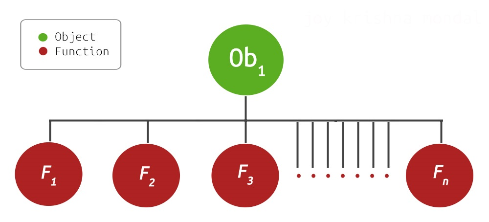
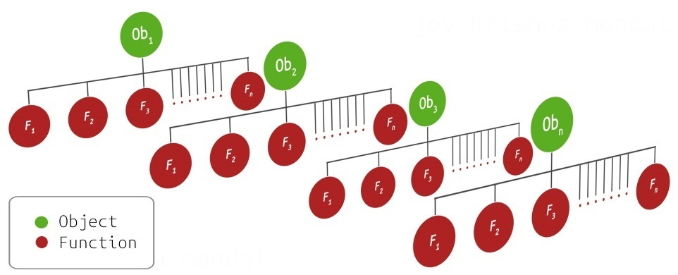
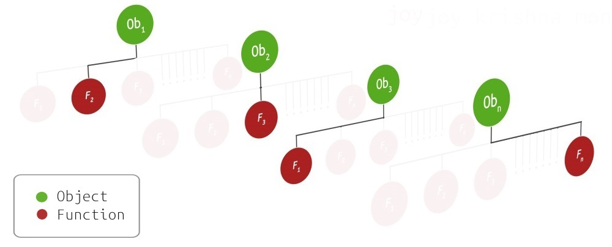

[](https://travis-ci.org/sourcevault/lazybindall)


**Install Using Any ..**
```
- npm install lazybindall

- npm install sourcevault/lazybindall

- npm install gitlab:sourcevault/lazybindall

- npm install @sourcevault/lazybindall
```

**Type Signature**

```haskell
lazybindall  :: ( ob , methds ) -> obmethds
``` 

-  `ob <Object>`  -  Methods in `methds` get bound to `Ob`.

-  `methds <Object>` - Object with props *that are methods* that we want to lock to `ob`

- `obmethds <Object>` is an object whose props are defined be `methds` and have there context locked to `ob`.

**Simple Example**

```javascript

var foo = {name:"sourcevault"}

var methds = 
  {
    show:function()
    {
      console.log (this)
    }
  }

// ----------------------------------------------

var lazybindall = require ("lazybindall")

var bound = lazybindall ( foo , methds )

bound.show() // {name:"sourcevault"}

```


## Let Me Explain ..

### Relevant Background

Locking context in Javascript can **only** happen through closures:

```javascript

var foo = function (x)
{
  this.value += x 
}

lockFoo = function (state) // <- state is captured in the inner function
{
  return function (x) 
  {
    foo.call (state,x) // state gets captured from the outer function 
  }
}  

state = {value:1}

lockedFoo = lockFoo (state) 

lockedFoo(3)

console.log (state) // {value:4}

```

The functionality expressed above is well encapculated in the `.bind` method that every function in javascript can call upon to lock context.

We can use `bind`  to create `bindall` which is just a for loop for applying bind for multiple functions.

The usecase for `bindall` is apparent when large number of methods with  internal state dependency require exporting. The issue arises due to the consumer having liberty to attach any exported function to external objects causing **mutation** to the internal `.this` variable - breaking any internal code that depends on `.this` staying invariant.

```javascript

// ./largeApi.js

// What a potential large API surface looks like 

Ob = function()
{
  this.resultList = [] 

  return (this)
}

Ob.prototype.f1 = function()
{
  var sum = 0
  // .... /
  this.resultList.push( sum )
  // .... /
  return (this)
}

Ob.prototype.f2 = function(){// .... /}

Ob.prototype.f3 = function(){// .... /}

  // .... /
  // .... /
  // .... /

Ob.prototype.f100 = function(){// .... /}

module.exports = Ob

```


```javascript

// test.js

var api = require ("./largeApi")

var _ = require ("underscore")

var instance = new api()

var boundApi = _.bindAll(instance)

setTimeout (boundApi.f1,1000) // [1] runs fine 

setTimeout (instance.f1,1000) 

// [2] TypeError: Cannot read property 'push' of undefined

// [2] ofcourse V8 vomited an error since .this of api.f1 points to global 


```

**ADDITIONAL  READING:**


- `underscore.js`'s [original implementation](https://github.com/jashkenas/underscore/blob/5c237a7c682fb68fd5378203f0bf22dce1624854/underscore.js#L799-L807) of `bindall`. 

- Michael Fogus's book ["*Introducting Functional Programming with Underscore.js*"](http://shop.oreilly.com/product/0636920028857.do) has more details involing functional design patterns invovling `bindall`. 

- [Here is my take](https://github.com/sourcevault/bindall) on `bindall`  

### Why Be Lazy ?

Using `bindall` is perfectly fine for most application but we should pay attention regarding what is happening at the margins. `.bindall` is making a copy of the data structure representing our module. If Fig 1 is the data structure showing our module, then `bindall` is making a modified copy  (copy not shown in Fig 1).


**Fig 1** is a graphical representation of the data structure of large exported module with internal state stored in an object.

The inefficiency in constantly making clones becomes more apparent when we consider the fact that the consumer might be interested in making *n* instances each attached to some unique object (Fig 2).


**Fig 2** - *n* instances with **unique** object (state) for each instance. 
(`bindall` clone not shown)

Its not difficult to see how this core operation applied to each module layer could quickly cause memory issues. APIs involving the DOM have large surface area for **each** document object
(ie. onclick,onhover,onmouseover ...).

There is something we notice when handling large APIs, that can give us clue as to how we can optimize - we *never* use **all** possible methods for each instance (Fig 3). The reason we expose large API surfaces in the first place is to expose all **possible** functionalities, so that it works under varied use, even as creator we do not expect complete method utilization at every use - this is where it pays to be lazy. 


**Fig 3** - In practice most methods calls will be sparsely distributed - `bindall` makes more sense for small APIs with dense use, however lazy binding works in both cases.

What we could do instead of an eagar `bindall` is to only `bind` when our function leaves the comfort of its parent object. 

We can do this by taking advantage of ES6 proxy getter hooks to lock context - instead of retroactively binding and **then** exporting it.

### Benchmark 

*...for 10,000 object with 9 methods*

|   Method         | Total Memory (MB) | Time (millisecond)  |
|:----------------:|------------------:|--------------------:|
|     `.prototype` |                  6|                   31|
| lazy  closure    |                  9|                   54|
| eagar closure    |                 49|                6,172|

**NOTES:**
- will be interesting to see how benchmark values change against *increasing* number of methods.

- `.prototype` is always going to be fastest because there is **no** closure creation - so state cannot be even passed to the event loop. It helps create a lower bound.

- Time and memory is related for our benchmark since we are are keeping CPU intensive tasks constant, hence it can be assumed that time is a reflection of how long it takes the system to allocate memory, giving eagar closures *both* a memory, and time penalty.

- benchmark source is `src/benchmark.ls`, run using `node dist/benchmark.js`

- hardware used - `i7-3667U CPU (2 GHz 2.5 GHz), (x64, 7.86 RAM)`


### TODO

- More user friendly API simarly to `sourcevault/bindall`

- `most.js` integration

### Updates and API change

- Initial `0.0.1` release with a single exported function.

## License
 
- Code released under MIT Licence, see [LICENSE](https://gitlab.com/sourcevault/lazybindall/blob/master/LICENCE) for details.

- Documentation and Images released using CC-BY-4.0 see [LICENSE](https://gitlab.com/sourcevault/lazybindall/blob/master/images/LICENCE) for details.


